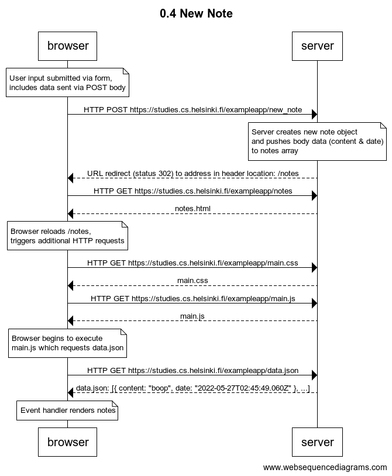

# Part 0

Learning Objective: The lesson covers some basic fundamentals to Web development.

- Exercises 0.1 - 0.3 was selective reading going over basics of HTML, CSS, and forms.
- Exercises 0.4 - 0.6 explores how pages communicate between the browser and server.

## Exercise 0.4: New Note

This diagram covers traditional web applications where the logic originates 
from the server and the browser renders the HTML. 

What happens when a note is submitted at [Example App](https://studies.cs.helsinki.fi/exampleapp/notes)?

    
Diagram Code

 
    title 0.4 New Note
    
    note over browser:
    User input submitted via form, 
    includes data sent via POST body
    end note
    
    browser->server: HTTP POST https://studies.cs.helsinki.fi/exampleapp/new_note
    
    note over server:
    Server creates new note object 
    and pushes body data (content & date) 
    to notes array
    end note
    
    server-->browser: URL redirect (status 302) to address in header location: /notes
    browser->server: HTTP GET https://studies.cs.helsinki.fi/exampleapp/notes
    server->browser: notes.html
    
    note over browser:
    Browser reloads /notes, 
    triggers additional HTTP requests
    end note
    
    browser->server: HTTP GET https://studies.cs.helsinki.fi/exampleapp/main.css
    server-->browser: main.css
    browser->server: HTTP GET https://studies.cs.helsinki.fi/exampleapp/main.js
    server-->browser: main.js
    
    note over browser:
    Browser begins to execute 
    main.js which requests data.json
    end note
    
    browser->server: HTTP GET https://studies.cs.helsinki.fi/exampleapp/data.json
    server-->browser: data.json: [{ content: "boop", date: "2022-05-27T02:45:49.060Z" }, ...]
    
    note over browser:
    Event handler renders notes
    end note  

## Exercise 0.5: Single Page App

## Exercise 0.6: New Note - SPA
